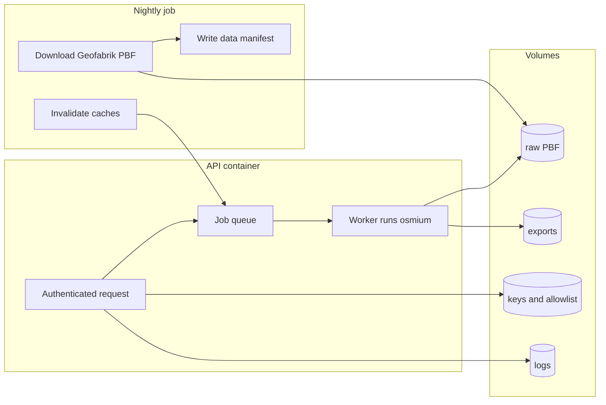

# Plan: FOSSGIS-compatible OSM extract API (Docker, Osmium, API keys)

## Scope and alignment with FOSSGIS funding

Use the official templates and process:

- General funding rules and timelines (typically **6–8 weeks** from application to decision; **post-funding report** for [fossgis.de](https://www.fossgis.de)): [Förderanträge](https://www.fossgis.de/wiki/F%C3%B6rderantr%C3%A4ge).
- Server application structure: [Vorlage Serverkostenförderung](https://www.fossgis.de/wiki/F%C3%B6rderantr%C3%A4ge/Vorlage_Serverkostenf%C3%B6rderung).
- **Sonderbestimmungen** (what you must operationalize on the server): [Sonderbestimmungen Serverkostenförderung](https://www.fossgis.de/wiki/Sonderbestimmungen_Serverkostenf%C3%B6rderung) — summarized for this project:

| Requirement | How this service satisfies it |
|-------------|-------------------------------|
| Open source, community-friendly | Public repo under a standard license (e.g. MIT/Apache-2.0); README invites contributors; API is a **public good** for allow-listed consumers. |
| Clear hardware justification | Document **Germany extract** baseline + optional **planet** cost note (see sizing below). |
| FOSSGIS root + documentation | Run on a VPS you administer; document host, Docker layout, backup of `keys/` and logs policy in FOSSGIS **IT-Infrastruktur** wiki (per Sonderbestimmungen). |
| Security & abuse mitigation | TLS, firewall, API keys, optional rate limits, no anonymous heavy jobs, logging; document measures in wiki. |
| Named Unix accounts | Any SSH users listed for FOSSGIS as required. |
| Community access “where possible” | Status endpoint and docs public; raw extract API remains keyed to prevent abuse. |

**Application text (Vorlage sections):** tie the project to **freie Geodaten** (OSM) and **freie GIS-Software** (Osmium toolchain), state repo URL + license, list monthly cost cap vs Hetzner-equivalent, and describe consequences of funding/non-funding (e.g. no shared nightly extracts for community tools).

**Important product clarification:** You described **nightly world PBF** from Geofabrik, but Geofabrik’s practical unit is **regional extracts** (e.g. `germany-latest.osm.pbf`) or **planet** (~70+ GiB). For **FOSSGIS sizing and feasibility**, plan the **hosted baseline = single regional extract (Germany)** unless you explicitly fund **planet** storage and RAM. The same API design applies; only the **input artifact** and **disk/RAM** change.

---

## High-level architecture

1. **Nightly**: Download/update the chosen PBF, record timestamps in a small **manifest** (JSON), then **bump a `data_revision`** and clear **logical** caches (see caching).
2. **Client** (with API key): `POST /v1/extracts` with Osmium-equivalent filter spec (tags + optional bbox/polygon). Response: `{ job_id, download_url, poll_url }`.
3. **Worker**: Runs `osmium` (e.g. `tags-filter`, `extract --bbox`, or pipeline of subcommands) → writes e.g. `.osm.pbf` or `.pbf` under `OUT/<job_id>/`.
4. **GET download URL**: `404`/`425` or `503` + `Retry-After` while running; `200` + file when done. All gated by the **same API key** (header) to avoid unauthenticated leeching of large files.
5. **Status**: `GET /v1/data-status` (or `/health/data`) reads manifest + optional `osmium fileinfo` for OSM **timestamp** from the PBF header.

---

## Docker layout (low maintenance)

- **`docker-compose.yml`**: services `api` (HTTP), `worker` (same image, different command), optional `caddy` or host **nginx** for TLS termination.
- **One image** with: **Bun** runtime, `osmium-tool` installed, minimal shell for subprocess calls.
- **Volumes** (bind mounts or named volumes):
  - `/data/raw` — current PBF + optional previous for atomic swap
  - `/data/exports` — job outputs (TTL cleanup policy, e.g. 7–30 days)
  - `/config` — `allowlist.yaml` + `api_keys.env` or `keys.json` (see auth)
  - `/var/log/osm-extract-api` — JSONL logs

Avoid Kubernetes unless you need multi-node; **Compose + one worker** is simpler and matches “wartungsarm”.

---

## Auth: GitHub allowlist + keys on disk

- **Git repo** (can live in this monorepo or adjacent): `allowlist.yaml` listing **approved consumers** (name, contact, optional GitHub org/user, intended use). This is the policy source of truth.
- **Deployment**: CI or manual **sync** copies `allowlist.yaml` + **`api_keys`** file to `/config` on the server (rsync, scp, or pull + restart). No vendor lock-in: keys are **plain files** you can edit with `vim` and back up.
- **Runtime check**: Request must present `Authorization: Bearer <key>`; server maps key → `consumer_id`, verifies consumer still **enabled** in allowlist.
- **Optional**: second file `keys.revoked` for instant revocation without editing allowlist.

---

## API shape (minimal, practical)

| Endpoint | Auth | Behavior |
|----------|------|----------|
| `POST /v1/extracts` | Required | Validates filter JSON against an **allowlist of permitted Osmium operations** (avoid arbitrary shell). Enqueues job; returns ids and URLs. |
| `GET /v1/extracts/:id` | Required | Metadata: state, `created_at`, `output_size`, error message. |
| `GET /v1/extracts/:id/file` | Required | Streams file when ready; otherwise structured “not ready” response. |
| `GET /v1/data-status` | Optional | Manifest: `geofabrik_download_completed_at`, `pbf_path`, `pbf_osm_timestamp` (from Osmium/OSM header), `data_revision`. |

**Filter contract (example):** JSON with `tags_filter` (Osmium tags-filter expression or structured tags you map to a safe fixed command template), optional `bbox` or `polygon_wkt`. **Do not** pass raw shell strings from clients; map to **whitelisted** command templates only.

---

## Caching and HTTP semantics (24h + invalidation)

- **Cache key**: hash of (`data_revision`, normalized filter spec, optional bbox).
- **Response**: On cache hit within 24h, return **same** `job_id`/`download_url` with headers:
  - `ETag` derived from cache key + `data_revision`
  - `Cache-Control: private, max-age=3600` (or your policy)
  - Custom: `X-Data-Revision: <rev>` so clients detect “same underlying OSM snapshot”
- **Invalidation**: Nightly job increments `data_revision` and deletes **server-side** cache rows (same **SQLite** DB as jobs). Clients relying on `ETag`/`X-Data-Revision` see that data changed after refresh.

---

## Logging (who, how often, how much)

- **Format**: one JSON object per line (**JSONL**), easy to `jq` and ship to a future log stack.
- **Fields**: `ts`, `key_id` (opaque id, not the secret), `consumer`, `route`, `bytes_out`, `job_id`, `duration_ms`, `status`, `filter_hash`.
- **Retention**: e.g. **90 days** on disk (rotate daily), with optional weekly archive to cold storage if FOSSGIS asks for longer audit — state the retention in the funding application.
- **Privacy**: Log **hashed** or **truncated** keys only if you ever log the header; prefer internal `key_id` only.

---

## Job orchestration (Bun + SQLite)

**Requirement:** start/manage Osmium processes, track state, avoid runaway concurrency.

**Stack:** **Bun** for the HTTP API and the worker process(es). **SQLite** on a persistent volume holds job rows (state, timestamps, output paths), the **24h idempotency / response cache**, and optional metrics counters—one database file, few moving parts, no separate queue broker.

**Worker model:** A Bun worker loop claims jobs with `SELECT ... FOR UPDATE` (or equivalent single-row locking), runs **Osmium as a subprocess** with timeouts and **ulimit** on output size, then updates job status. Use **one worker container** with `max_concurrent_jobs=1` or `2` to cap RAM; add a second worker container later if throughput requires it (still SQLite with care for concurrent writers, or split read-heavy API from writer worker).

Osmium is always invoked as **subprocess** with timeouts and **ulimit** on output size where possible.

---

## Server sizing (Germany extract, Osmium filtering)

Rough orders of magnitude (verify against current Geofabrik file sizes before ordering):

| Resource | Germany baseline | Notes |
|----------|------------------|--------|
| **Disk** | **~80–150 GB** usable | Germany PBF ~3–4 GB compressed; unpacked/working space + multiple concurrent export outputs + logs; headroom for growth. |
| **RAM** | **16–32 GB** | Osmium is streaming but spikes and OS cache help; 8 GB is risky for large filters + parallel HTTP. |
| **vCPU** | **4–8** | Faster extracts; diminishing returns if single-threaded Osmium dominates. |
| **Network** | Sustained download | Nightly Geofabrik pull + client downloads of exports. |

**Planet baseline (only if explicitly in scope):** often **≥2 TB** disk and **≥64 GB RAM** and different operational story — call this out in the FOSSGIS application as a **separate cost tier** or out of scope.

Your existing benchmark repo already uses Germany + Osmium paths ([`pipelines/osmium-gdal-tippecanoe/scripts/run.sh`](pipelines/osmium-gdal-tippecanoe/scripts/run.sh)); reuse **tags-filter** patterns and timing notes from [`results/summary.md`](results/summary.md) as **evidence** in the funding justification.

---

## Security checklist (for wiki + application)

- TLS (Let’s Encrypt), SSH keys only, firewall (22 + 443 only), fail2ban optional.
- API key required for **job creation and download**.
- Per-key **rate limits** (e.g. N jobs/day) enforced from allowlist config.
- **Output size** and **wall-clock** limits per job; kill subprocess on exceed.
- Regular unattended upgrades for base OS + `docker compose pull`.

---

## Deliverables for FOSSGIS (after approval)

- Short **report** for [fossgis.de](https://www.fossgis.de): what was built, URL, how community can request access, metrics (uptime, rough usage).
- **IT-Infrastruktur** wiki page: host, Compose location, where keys live, how to rotate, log location, restore procedure.

---

## Open decisions (resolve before implementation)

1. **Input dataset:** Germany-only vs planet (drives cost and nightly download time).
2. **Output format:** `.osm.pbf` only vs optional GeoPackage/GeoJSON (adds GDAL in image, heavier).
3. **Maximum concurrent jobs:** 1 vs 2 (RAM vs latency).
4. **Whether `/v1/data-status` is public** or key-protected (you said either is fine).
