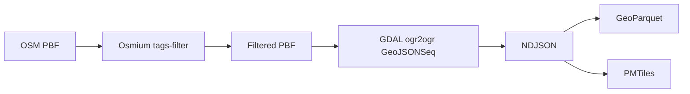
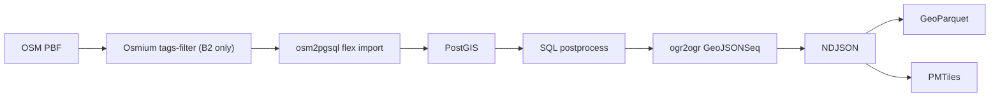
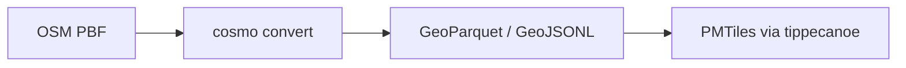
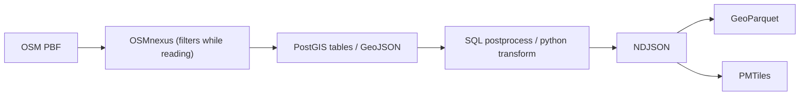

# Archived pipelines — playgrounds benchmark (2026-04 … 2026-07)

The playground benchmark compared 9 pipeline variants extracting `leisure=playground` OR `playground=*`
(nodes/ways/relations) from Berlin/Germany PBFs into GeoParquet + PMTiles.

**All code lives at git tag [`playgrounds-benchmark-final`](../../../../../tree/playgrounds-benchmark-final)
(commit `84aee24`)** under `pipelines/<name>/`. This file preserves the gist of each pipeline;
see [findings.md](findings.md) for cross-cutting learnings and [summary.md](summary.md) for the final report.

Final Germany numbers (2026-07-10, `germany-latest.osm.pbf` 4.7 GB):

| Pipeline | Container | Features | Enriched polygons | Verdict |
| --- | --- | --- | --- | --- |
| osmium-gdal-tippecanoe | 1.0 min | 218 066 | — | retired: GDAL layer semantics unsuited for rule-based processing |
| osm2pgsql-postgis-direct (B1) | 74 min¹ | 218 138 | 103 458 | carried forward as "direct" case |
| osm2pgsql-postgis-prefilter (B2, reference) | 1.9 min | 218 138 | 103 458 | carried forward as "prefilter-osmium" case |
| osm2pgsql-postgis-prefilter-osmfilter | 6.0 min | 218 138 | 103 458 | retired: osmconvert cost > filter savings (settled) |
| planetiler-playgrounds | 8.2 min | — | — | retired: YAML rules can't express complex classification |
| cosmo-playgrounds-dual-pass | 6.7 min | 217 640 | — | retired: no classification engine |
| cosmo-playgrounds-single-pass | 5.6 min | 217 640 | — | retired: no classification engine |
| osmnexus-postgis | 10.6 min | 218 167 | 103 478 | carried forward (new topic) |
| osmnexus-geojson-direct | 2.4 min | 218 167 | — | carried forward (new topic, streamed output) |

¹ measured on a degraded-disk day (Docker VM disk exhaustion incident); May run: 23 min.

---

## osmium-gdal-tippecanoe ("pipeline A")

Osmium prefilter on PBF, GDAL to GeoJSONSeq, then GeoParquet (GeoPandas) and PMTiles (tippecanoe). No database.

Key tricks / gotchas:
- GDAL's OSM driver splits output into `points`/`lines`/`multipolygons` layers; closed ways surface in
  `multipolygons` via `osm_way_id`, relations via `osm_id`. Non-multipolygon relation types (`type=site`)
  land in the unexported `other_relations` layer — 4 relations were structurally unreachable.
- Because `osmium tags-filter` keeps *referenced* objects, a per-layer tag re-gate was required
  (`-where "leisure = 'playground' OR playground IS NOT NULL"` with a vendored `osmconf.ini` exposing
  those keys as columns) — without it, 1 148 unrelated tagged nodes (gates, access nodes) leaked into the export.
- No SQL stage → no enrichment; each feature once after the tag-gate fix (10 623 Berlin).

Why retired: filtering/classification must be expressed in GDAL/SQL-on-layers terms — unusable for the
rule-based bikelanes processing; layer semantics repeatedly surprised us.

## osm2pgsql-postgis-direct ("B1") and osm2pgsql-postgis-prefilter ("B2", reference)

Full-PBF (B1) vs osmium-prefiltered (B2) osm2pgsql flex import into in-container PostGIS,
SQL enrichment (`play_equipment_count` via ST_Intersects), ogr2ogr NDJSON, GeoParquet + PMTiles.

Key pieces: `style/playground.lua` (four tables: points/lines/polygons-way/polygons-relation,
`is_target` = the benchmark filter), `sql/postprocess.sql` (polygon union → equipment table →
ST_Intersects enrichment → single `benchmark.playground_export`).

Gotchas fixed along the way (see findings.md): the lua inserted closed ways as BOTH line and polygon,
which double-exported 4 572 features until the export union got a `NOT EXISTS` dedup; `as_multipolygon()`
silently drops broken relations (1 on Berlin, ~29 on Germany).

Why archived in this form: both cases carry forward into the bikelanes benchmark with the real
tilda-geo lua instead of the toy playground style.

## osm2pgsql-postgis-prefilter-osmfilter

B2 with the prefilter swapped to `osmconvert → .o5m → osmfilter --keep=...`.

**Settled conclusion:** on Germany the filter step took 308 s vs osmium's 72 s — the o5m conversion
costs far more than osmfilter saves. Berlin was a wash. Not carried forward.

## planetiler-playgrounds

Single Planetiler JVM pass from PBF to PMTiles via YAML `custommap` rules (`playgrounds.yml`). No GeoParquet, no SQL.

Fast and simple for tile-only outputs, but: no per-feature export comparable to GeoJSONSeq
(feature_count not comparable), no GeoParquet, and YAML rules cannot express multi-level
classification/derivation. Why retired: cannot participate in the classification benchmark.

## cosmo-playgrounds (dual-pass / single-pass)

Rust `cosmo convert` (codeberg.org/mvexel/cosmo, pinned `11ff3d2`) with a YAML tag filter.
Dual-pass: native GeoParquet + second pass GeoJSONL→tippecanoe. Single-pass: one GeoJSONL pass,
GDAL normalization, GeoPandas Parquet.

Notes: fastest raw extractor of the field (Germany single-pass 5.6 min incl. exports); exports no
relation features (`relation: false`); filter-only — no classification, no derivation, no SQL.
Why retired: no classification engine; cannot express the bikelanes rules.

## osmnexus-postgis / osmnexus-geojson-direct

Rust streaming classifier (github.com/rush42/OSMnexus, pinned `1eae18d` + vendored
`standalone-nodes.patch`), JSON rule config for the playground filter, PostGIS variant with the same
SQL enrichment as B2 (plus polygonization of nexus's linestring rings), geojson variant with a python
transform (segment stitching by seg_idx, id-prefix keying, shapely `build_area` for relation holes).

Key learnings (details in findings.md): upstream drops standalone tagged nodes (patched; upstream
issue rush42/OSMnexus#1); coordinates stored as f32 (≤0.21 m point displacement); closed ways are
LineString rings (polygonize downstream); relation inner/outer roles lost (holes recovered
geometrically — verified correct); `--output geojson` builds one in-memory FeatureCollection with
per-edge-segment features (motivated the geojsonseq patch in the successor benchmark).

Why archived in this form: carried forward for the bikelanes topic with OSMnexus's own tilda config
and a new streaming output mode; the playground-specific config/SQL stays here.
