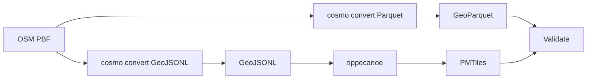
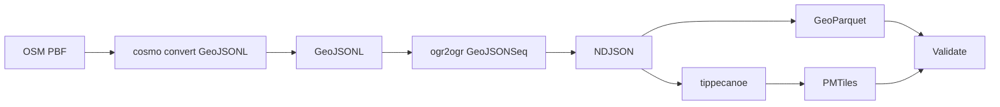
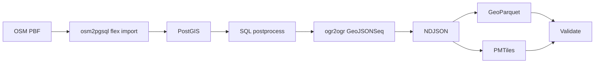
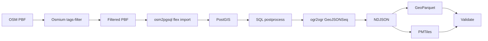
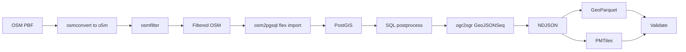
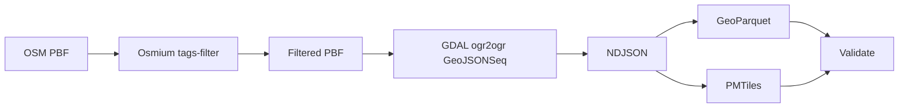
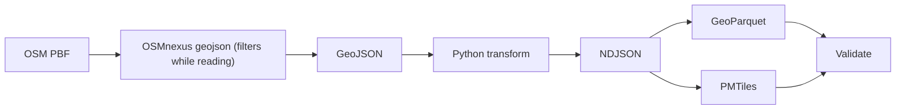
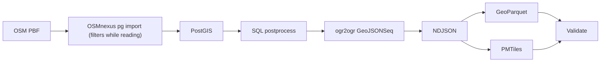

# Benchmark Summary

Generated from run artifact: `/Users/tordans/Development/OSM/osm-processing-pipeline-comparison/results/runs/run-2026-07-10T19-07-25-140Z-germany.json`

- **Run ID:** `2026-07-10T19-07-25-140Z`
- **Dataset:** `germany`
- **Input:** `/Users/tordans/Development/OSM/osm-processing-pipeline-comparison/data/raw/germany-latest.osm.pbf`
- **Window:** `2026-07-10T19:07:25.140Z` → `2026-07-10T20:21:11.199Z`
- **Pipelines OK:** 9 / 9
- **Reused from cache:** 8 pipeline(s) (see footnote under timings)

## How to read this report

- Timings and requirement status are read from each pipeline’s `comparison.json` only.
- **Build** is `docker build` time on the host (one-time per image change).
- **Container** is wall time for `docker run`.
- **In-container total** is script wall time inside the container.
- **Durations** use `M:SS` (minutes:seconds), rounded to the nearest second.
- **Pipeline** names in tables link to [Pipeline flows](#pipeline-flows) below.

## Dataset used for this run

- **Name:** `germany`
- **Input path:** `/workspace/data/raw/germany-latest.osm.pbf`
- **Source URL:** https://download.geofabrik.de/europe/germany-latest.osm.pbf

## Comparable timings and requirements

All values come from each pipeline’s `comparison.json` (canonical schema). `—` means the step is not applicable for that pipeline.

| Pipeline | Dataset | Filter | Clean/transform | GeoParquet | PMTiles | SQL postprocess | Validate | In-container total | Build | Container | Total |
| --- | --- | --- | --- | --- | --- | --- | --- | --- | --- | --- | --- |
| [cosmo-playgrounds-dual-pass](#cosmo-playgrounds-dual-pass) | germany | — | 3:03 | 3:20 | 0:13 | — | 0:01 | 6:37 | 0:02 | 6:40 | 6:42 |
| [cosmo-playgrounds-single-pass](#cosmo-playgrounds-single-pass) | germany | — | 5:03 | 0:10 | 0:19 | — | 0:01 | 5:33 | 0:04 | 5:34 | 5:38 |
| [osm2pgsql-postgis-direct](#osm2pgsql-postgis-direct) | germany | — | 70:30 | 0:04 | 0:07 | 0:08 | 0:01 | 70:49 | 2:51 | 70:55 | 73:46 |
| [osm2pgsql-postgis-prefilter](#osm2pgsql-postgis-prefilter) | germany | 1:12 | 0:09 | 0:05 | 0:11 | 0:07 | 0:01 | 1:47 | 0:08 | 1:57 | 2:05 |
| [osm2pgsql-postgis-prefilter-osmfilter](#osm2pgsql-postgis-prefilter-osmfilter) | germany | 5:08 | 0:14 | 0:07 | 0:22 | 0:07 | 0:01 | 6:02 | 0:01 | 6:03 | 6:04 |
| [osmium-gdal-tippecanoe](#osmium-gdal-tippecanoe) | germany | 0:42 | 0:03 | 0:06 | 0:07 | — | 0:00 | 0:58 | 0:06 | 0:59 | 1:04 |
| [osmnexus-geojson-direct](#osmnexus-geojson-direct) | germany | — | 2:12 | 0:03 | 0:10 | — | 0:01 | 2:25 | 0:02 | 2:26 | 2:28 |
| [osmnexus-postgis](#osmnexus-postgis) | germany | — | 2:08 | 0:05 | 0:11 | 8:06 | 0:01 | 10:34 | 0:02 | 10:35 | 10:37 |
| [planetiler-playgrounds](#planetiler-playgrounds) | germany | — | — | — | 8:10 | — | 0:00 | 8:10 | 0:02 | 8:11 | 8:13 |

### Cached pipeline results

These pipelines were unchanged since a prior successful run; timings below are from the original run (no docker build/run this session).

- **[cosmo-playgrounds-dual-pass](#cosmo-playgrounds-dual-pass):** ok (cached 2026-07-10) — original run `2026-07-10T11-23-16-584Z`, recorded 2026-07-10T12:30:12.482Z
- **[cosmo-playgrounds-single-pass](#cosmo-playgrounds-single-pass):** ok (cached 2026-07-10) — original run `2026-07-10T11-23-16-584Z`, recorded 2026-07-10T12:30:12.482Z
- **[osm2pgsql-postgis-prefilter](#osm2pgsql-postgis-prefilter):** ok (cached 2026-07-10) — original run `2026-07-10T11-23-16-584Z`, recorded 2026-07-10T12:30:12.482Z
- **[osm2pgsql-postgis-prefilter-osmfilter](#osm2pgsql-postgis-prefilter-osmfilter):** ok (cached 2026-07-10) — original run `2026-07-10T11-23-16-584Z`, recorded 2026-07-10T12:30:12.482Z
- **[osmium-gdal-tippecanoe](#osmium-gdal-tippecanoe):** ok (cached 2026-07-10) — original run `2026-07-10T11-23-16-584Z`, recorded 2026-07-10T12:30:12.482Z
- **[osmnexus-geojson-direct](#osmnexus-geojson-direct):** ok (cached 2026-07-10) — original run `2026-07-10T11-23-16-584Z`, recorded 2026-07-10T12:30:12.482Z
- **[osmnexus-postgis](#osmnexus-postgis):** ok (cached 2026-07-10) — original run `2026-07-10T11-23-16-584Z`, recorded 2026-07-10T12:30:12.482Z
- **[planetiler-playgrounds](#planetiler-playgrounds):** ok (cached 2026-07-10) — original run `2026-07-10T11-23-16-584Z`, recorded 2026-07-10T12:30:12.482Z

### Core requirements

| Pipeline | 1. GeoParquet | 2. PMTiles | 3. Filter/clean/confirmed | 4. SQL postprocess/confirmed | Val OK | Features | Parquet | PMTiles |
| --- | --- | --- | --- | --- | --- | --- | --- | --- |
| [cosmo-playgrounds-dual-pass](#cosmo-playgrounds-dual-pass) | yes | yes | yes | no (Pipeline has no SQL/PostGIS stage) | yes | 217640 | 19.62 MiB | 6.97 MiB |
| [cosmo-playgrounds-single-pass](#cosmo-playgrounds-single-pass) | yes | yes | yes | no (Pipeline has no SQL/PostGIS stage) | yes | 217640 | 15.68 MiB | 6.97 MiB |
| [osm2pgsql-postgis-direct](#osm2pgsql-postgis-direct) | yes | yes | yes | yes | yes | 218138 | 17.59 MiB | 16.44 MiB |
| [osm2pgsql-postgis-prefilter](#osm2pgsql-postgis-prefilter) | yes | yes | yes | yes | yes | 218138 | 17.59 MiB | 16.44 MiB |
| [osm2pgsql-postgis-prefilter-osmfilter](#osm2pgsql-postgis-prefilter-osmfilter) | yes | yes | yes | yes | yes | 218138 | 17.59 MiB | 16.44 MiB |
| [osmium-gdal-tippecanoe](#osmium-gdal-tippecanoe) | yes | yes | yes | no (Pipeline has no SQL/PostGIS stage) | yes | 218066 | 19.04 MiB | 20.81 MiB |
| [osmnexus-geojson-direct](#osmnexus-geojson-direct) | yes | yes | yes | no (Pipeline has no SQL/PostGIS stage) | yes | 218167 | 15.98 MiB | 15.87 MiB |
| [osmnexus-postgis](#osmnexus-postgis) | yes | yes | yes | yes | yes | 218167 | 16.19 MiB | 16.44 MiB |
| [planetiler-playgrounds](#planetiler-playgrounds) | no (Planetiler does not emit GeoParquet) | yes | yes | no (Pipeline has no SQL/PostGIS stage) | yes | — | — | 30.57 MiB |

## Pipeline flows

How each pipeline processes the same input PBF. Pipeline names in the tables above link here.

### Quick links

[cosmo-playgrounds-dual-pass](#cosmo-playgrounds-dual-pass) · [cosmo-playgrounds-single-pass](#cosmo-playgrounds-single-pass) · [osm2pgsql-postgis-direct](#osm2pgsql-postgis-direct) · [osm2pgsql-postgis-prefilter](#osm2pgsql-postgis-prefilter) · [osm2pgsql-postgis-prefilter-osmfilter](#osm2pgsql-postgis-prefilter-osmfilter) · [osmium-gdal-tippecanoe](#osmium-gdal-tippecanoe) · [osmnexus-geojson-direct](#osmnexus-geojson-direct) · [osmnexus-postgis](#osmnexus-postgis) · [planetiler-playgrounds](#planetiler-playgrounds)

### cosmo-playgrounds-dual-pass

Two cosmo convert passes on the PBF: native GeoParquet, then GeoJSONL for tippecanoe PMTiles.

### cosmo-playgrounds-single-pass

One cosmo convert to GeoJSONL, GDAL normalization, then GeoPandas Parquet and tippecanoe PMTiles.

### osm2pgsql-postgis-direct

Full PBF import via osm2pgsql flex into PostGIS, SQL enrichment, then shared NDJSON exports. No upstream prefilter.

### osm2pgsql-postgis-prefilter

Osmium prefilter before osm2pgsql; same PostGIS SQL and export path as B1 (B2 reference pipeline).

### osm2pgsql-postgis-prefilter-osmfilter

Prefilter via osmconvert + osmfilter (o5m), then same osm2pgsql → PostGIS → exports stack as B2.

### osmium-gdal-tippecanoe

Osmium prefilter on PBF, GDAL to GeoJSONSeq, then GeoParquet (GeoPandas) and PMTiles (tippecanoe). No database.

### osmnexus-geojson-direct

OSMnexus filters while reading the full PBF to GeoJSON, Python segment merge and polygonize, then shared exports. No database.

### osmnexus-postgis

OSMnexus filters while importing the full PBF into Postgres; same PostGIS SQL and export path as B2.

### planetiler-playgrounds

Single Planetiler JVM pass from PBF to PMTiles via YAML rules. No GeoParquet or SQL stage.

## vs osm2pgsql + Osmium prefilter (B2 reference)

Baseline: **osm2pgsql-postgis-prefilter** (Osmium `tags-filter` + osm2pgsql → PostGIS → exports). Other pipelines show wall-time deltas and relative duration vs that baseline.

| Pipeline | Total (build+run) vs B2 | Container vs B2 | In-container (script) vs B2 |
| --- | --- | --- | --- |
| [osm2pgsql-postgis-prefilter](#osm2pgsql-postgis-prefilter) | baseline | baseline | baseline |
| [cosmo-playgrounds-dual-pass](#cosmo-playgrounds-dual-pass) | 4:37 slower; 221.5% more time than reference | 4:43 slower; 242.8% more time than reference | 4:50 slower; 271.2% more time than reference |
| [cosmo-playgrounds-single-pass](#cosmo-playgrounds-single-pass) | 3:33 slower; 170.3% more time than reference | 3:38 slower; 186.5% more time than reference | 3:46 slower; 211.5% more time than reference |
| [osm2pgsql-postgis-direct](#osm2pgsql-postgis-direct) | 71:41 slower; 3438.6% more time than reference | 68:58 slower; 3547.2% more time than reference | 69:02 slower; 3875.4% more time than reference |
| [osm2pgsql-postgis-prefilter-osmfilter](#osm2pgsql-postgis-prefilter-osmfilter) | 3:59 slower; 191.0% more time than reference | 4:06 slower; 210.9% more time than reference | 4:15 slower; 238.6% more time than reference |
| [osmium-gdal-tippecanoe](#osmium-gdal-tippecanoe) | 1:01 faster; 48.7% less time than reference | 0:58 faster; 49.8% less time than reference | 0:49 faster; 45.5% less time than reference |
| [osmnexus-geojson-direct](#osmnexus-geojson-direct) | 0:22 slower; 18.0% more time than reference | 0:29 slower; 25.0% more time than reference | 0:39 slower; 36.1% more time than reference |
| [osmnexus-postgis](#osmnexus-postgis) | 8:32 slower; 409.6% more time than reference | 8:38 slower; 444.2% more time than reference | 8:47 slower; 493.0% more time than reference |
| [planetiler-playgrounds](#planetiler-playgrounds) | 6:08 slower; 294.2% more time than reference | 6:14 slower; 320.9% more time than reference | 6:23 slower; 358.1% more time than reference |

### Comparable in-container steps (canonical `comparison.json` keys)

Only canonical steps with numeric timings in B2 and another pipeline; empty cells mean that pipeline has no timing for that step.

| Step | [cosmo-playgrounds-dual-pass](#cosmo-playgrounds-dual-pass) | [cosmo-playgrounds-single-pass](#cosmo-playgrounds-single-pass) | [osm2pgsql-postgis-direct](#osm2pgsql-postgis-direct) | [osm2pgsql-postgis-prefilter-osmfilter](#osm2pgsql-postgis-prefilter-osmfilter) | [osmium-gdal-tippecanoe](#osmium-gdal-tippecanoe) | [osmnexus-geojson-direct](#osmnexus-geojson-direct) | [osmnexus-postgis](#osmnexus-postgis) | [planetiler-playgrounds](#planetiler-playgrounds) |
| --- | --- | --- | --- | --- | --- | --- | --- | --- |
| filter | — | — | — | 3:57 slower; 330.1% more time than reference | 0:30 faster; 41.5% less time than reference | — | — | — |
| cleanTransform | 2:54 slower; 1863.7% more time than reference | 4:54 slower; 3147.1% more time than reference | 70:20 slower; 45230.4% more time than reference | 0:05 slower; 49.9% more time than reference | 0:06 faster; 63.0% less time than reference | 2:02 slower; 1311.2% more time than reference | 1:59 slower; 1270.4% more time than reference | — |
| exportGeoParquet | 3:15 slower; 3851.8% more time than reference | 0:05 slower; 100.2% more time than reference | 0:01 faster; 18.5% less time than reference | 0:02 slower; 34.0% more time than reference | 0:01 slower; 12.2% more time than reference | 0:02 faster; 35.7% less time than reference | 0:00 slower; 1.6% more time than reference | — |
| exportPmtiles | 0:02 slower; 19.9% more time than reference | 0:08 slower; 75.3% more time than reference | 0:04 faster; 37.1% less time than reference | 0:11 slower; 107.3% more time than reference | 0:04 faster; 36.9% less time than reference | 0:01 faster; 7.0% less time than reference | 0:01 slower; 5.4% more time than reference | 7:59 slower; 4489.5% more time than reference |
| sqlPostprocess | — | — | 0:00 slower; 6.9% more time than reference | 0:00 slower; 3.8% more time than reference | — | — | 7:59 slower; 6818.5% more time than reference | — |
| validate | 0:01 slower; 82.4% more time than reference | 0:00 slower; 76.5% more time than reference | 0:00 faster; 17.0% less time than reference | 0:00 slower; 60.4% more time than reference | 0:00 faster; 24.4% less time than reference | 0:00 slower; 3.4% more time than reference | 0:00 slower; 18.1% more time than reference | 0:01 faster; 83.2% less time than reference |

## B2 vs osmfilter prefilter (Osmium vs osmctools)

Same downstream steps as B2; only the prefilter differs: **B2** uses Osmium `tags-filter` on PBF; **osmfilter pipeline** uses `osmconvert` (full PBF→`.o5m`) then `osmfilter` (see [osmium-tool#253](https://github.com/osmcode/osmium-tool/issues/253)).

- **B2 prefilter (Osmium):** 1:12
- **osmfilter pipeline prefilter (total):** 5:08
- **Prefilter ratio (osmfilter total ÷ B2 Osmium):** 4.30×

## Cosmo dual-pass vs single-pass + GDAL

**Dual-pass:** two `cosmo convert` runs (native GeoParquet + GeoJSONL) then tippecanoe. **Single-pass:** one `cosmo convert` → `ogr2ogr` GeoJSONSeq → GeoPandas Parquet + tippecanoe.

| Metric | [dual-pass](#cosmo-playgrounds-dual-pass) | [single-pass](#cosmo-playgrounds-single-pass) | dual vs single |
| --- | --- | --- | --- |
| Total (build+run) | 6:42 | 5:38 | 1:04 faster; 15.9% less time than reference |
| Container wall | 6:40 | 5:34 | 1:06 faster; 16.4% less time than reference |
| In-container (script) | 6:37 | 5:33 | 1:04 faster; 16.1% less time than reference |

- **Cosmo OSM read time (dual):** 6:23 (`exportGeoParquet` + `cleanTransform`)
- **Cosmo OSM read time (single):** 5:03 (`cleanTransform`)
- **Cosmo read ratio (dual total ÷ single):** 1.26×

### Step breakdown (in-container)

| Step | [dual-pass](#cosmo-playgrounds-dual-pass) | [single-pass](#cosmo-playgrounds-single-pass) | dual vs single |
| --- | --- | --- | --- |
| `cleanTransform` | 3:03 | 5:03 | 2:00 slower; 65.4% more time than reference |
| `exportGeoParquet` | 3:20 | 0:10 | 3:09 faster; 94.9% less time than reference |
| `exportPmtiles` | 0:13 | 0:19 | 0:06 slower; 46.2% more time than reference |
| `validate` | 0:01 | 0:01 | 0:00 faster; 3.2% less time than reference |

## Cross-pipeline sanity (feature counts)

- **[osmium-gdal-tippecanoe](#osmium-gdal-tippecanoe):** 218066 features
- **[osm2pgsql B1](#osm2pgsql-postgis-direct):** 218138 features
- **Delta:** -72 (-0.0% vs B1). Different OSM-to-geometry assembly (GDAL OSM driver vs osm2pgsql flex) commonly yields small count differences; B1 and B2 should match when the extract is equivalent.

## Validation warnings

- **[cosmo-playgrounds-dual-pass](#cosmo-playgrounds-dual-pass):** Cosmo relation geometry omitted (relation: false); counts may be lower than nwr/osmium pipelines.
- **[cosmo-playgrounds-dual-pass](#cosmo-playgrounds-dual-pass):** GeoParquet from native cosmo; PMTiles from a second full OSM read via cosmo GeoJSONL.
- **[cosmo-playgrounds-single-pass](#cosmo-playgrounds-single-pass):** Cosmo relation geometry omitted (relation: false); counts may be lower than nwr/osmium pipelines.
- **[cosmo-playgrounds-single-pass](#cosmo-playgrounds-single-pass):** GeoParquet via GeoPandas from GDAL-normalized GeoJSONSeq (not cosmo-native Parquet).

## B1 vs B2 (prefilter vs direct osm2pgsql)

- **End-to-end (build + container wall):** B2 is 71:41 faster than B1.
- **B2 osmium prefilter:** 1:12
- **Clean/transform (B2 − B1):** -70:20
- **In-container total (B2 − B1):** -69:02 (from each pipeline’s `comparison.json`, excludes image build)

## Failures

None.

## Installation cost notes

Image build time dominates the first run; for recurring benchmarks, compare **In-container (script)** and **Container** after images are built. Setup/install cost is documented in `results/notes/installation-costs.md` (not part of processing totals).

## Raw artifacts

- Per-pipeline: `data/output/<pipeline-id>/<dataset>/comparison.json`, `validation.json`, `step_timings.json`
- Full run: `results/runs/*.json`
