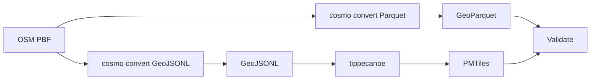
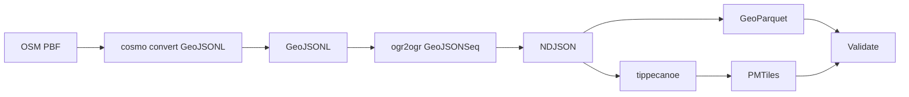
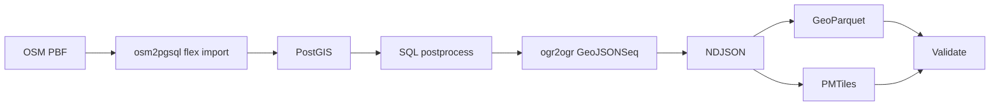
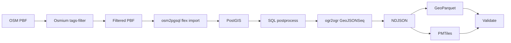
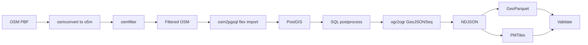
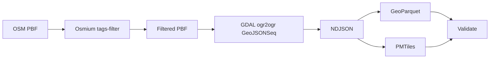
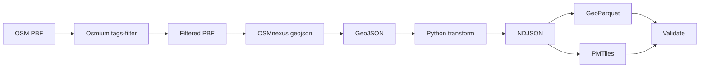
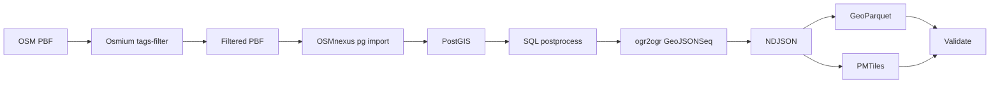

# Benchmark Summary

Generated from run artifact: `/Users/tordans/Development/OSM/osm-processing-pipeline-comparison/results/runs/run-2026-07-10T09-04-08-527Z-berlin.json`

- **Run ID:** `2026-07-10T09-04-08-527Z`
- **Dataset:** `berlin`
- **Input:** `/Users/tordans/Development/OSM/osm-processing-pipeline-comparison/data/raw/berlin-latest.osm.pbf`
- **Window:** `2026-07-10T09:04:08.527Z` → `2026-07-10T09:05:24.217Z`
- **Pipelines OK:** 9 / 9

## How to read this report

- Timings and requirement status are read from each pipeline’s `comparison.json` only.
- **Build** is `docker build` time on the host (one-time per image change).
- **Container** is wall time for `docker run`.
- **In-container total** is script wall time inside the container.
- **Durations** use `M:SS` (minutes:seconds), rounded to the nearest second.
- **Pipeline** names in tables link to [Pipeline flows](#pipeline-flows) below.

## Dataset used for this run

- **Name:** `berlin`
- **Input path:** `/workspace/data/raw/berlin-latest.osm.pbf`
- **Source URL:** https://download.geofabrik.de/europe/germany/berlin-latest.osm.pbf

## Comparable timings and requirements

All values come from each pipeline’s `comparison.json` (canonical schema). `—` means the step is not applicable for that pipeline.

| Pipeline | Dataset | Filter | Clean/transform | GeoParquet | PMTiles | SQL postprocess | Validate | In-container total | Build | Container | Total |
| --- | --- | --- | --- | --- | --- | --- | --- | --- | --- | --- | --- |
| [cosmo-playgrounds-dual-pass](#cosmo-playgrounds-dual-pass) | berlin | — | 0:01 | 0:01 | 0:00 | — | 0:00 | 0:03 | 0:01 | 0:04 | 0:05 |
| [cosmo-playgrounds-single-pass](#cosmo-playgrounds-single-pass) | berlin | — | 0:02 | 0:00 | 0:00 | — | 0:00 | 0:03 | 0:01 | 0:03 | 0:03 |
| [osm2pgsql-postgis-direct](#osm2pgsql-postgis-direct) | berlin | — | 0:22 | 0:01 | 0:01 | 0:00 | 0:00 | 0:24 | 0:01 | 0:27 | 0:28 |
| [osm2pgsql-postgis-prefilter](#osm2pgsql-postgis-prefilter) | berlin | 0:02 | 0:01 | 0:01 | 0:00 | 0:00 | 0:00 | 0:06 | 0:01 | 0:06 | 0:07 |
| [osm2pgsql-postgis-prefilter-osmfilter](#osm2pgsql-postgis-prefilter-osmfilter) | berlin | 0:03 | 0:01 | 0:01 | 0:01 | 0:00 | 0:00 | 0:08 | 0:01 | 0:08 | 0:09 |
| [osmium-gdal-tippecanoe](#osmium-gdal-tippecanoe) | berlin | 0:02 | 0:00 | 0:01 | 0:01 | — | 0:00 | 0:04 | 0:01 | 0:04 | 0:05 |
| [osmnexus-geojson-direct](#osmnexus-geojson-direct) | berlin | 0:01 | 0:01 | 0:00 | 0:01 | — | 0:00 | 0:03 | 0:01 | 0:03 | 0:04 |
| [osmnexus-postgis](#osmnexus-postgis) | berlin | 0:01 | 0:01 | 0:00 | 0:01 | 0:01 | 0:00 | 0:06 | 0:01 | 0:06 | 0:07 |
| [planetiler-playgrounds](#planetiler-playgrounds) | berlin | — | — | — | 0:06 | — | 0:00 | 0:06 | 0:01 | 0:06 | 0:07 |

### Core requirements

| Pipeline | 1. GeoParquet | 2. PMTiles | 3. Filter/clean/confirmed | 4. SQL postprocess/confirmed | Val OK | Features | Parquet | PMTiles |
| --- | --- | --- | --- | --- | --- | --- | --- | --- |
| [cosmo-playgrounds-dual-pass](#cosmo-playgrounds-dual-pass) | yes | yes | yes | no (Pipeline has no SQL/PostGIS stage) | yes | 10598 | 1.19 MiB | 410.0 KiB |
| [cosmo-playgrounds-single-pass](#cosmo-playgrounds-single-pass) | yes | yes | yes | no (Pipeline has no SQL/PostGIS stage) | yes | 10598 | 984.2 KiB | 410.0 KiB |
| [osm2pgsql-postgis-direct](#osm2pgsql-postgis-direct) | yes | yes | yes | yes | yes | 10627 | 1.05 MiB | 884.8 KiB |
| [osm2pgsql-postgis-prefilter](#osm2pgsql-postgis-prefilter) | yes | yes | yes | yes | yes | 10627 | 1.05 MiB | 884.8 KiB |
| [osm2pgsql-postgis-prefilter-osmfilter](#osm2pgsql-postgis-prefilter-osmfilter) | yes | yes | yes | yes | yes | 10627 | 1.05 MiB | 884.8 KiB |
| [osmium-gdal-tippecanoe](#osmium-gdal-tippecanoe) | yes | yes | yes | no (Pipeline has no SQL/PostGIS stage) | yes | 11789 | 1.18 MiB | 1.20 MiB |
| [osmnexus-geojson-direct](#osmnexus-geojson-direct) | yes | yes | yes | no (Pipeline has no SQL/PostGIS stage) | yes | 10628 | 949.2 KiB | 859.8 KiB |
| [osmnexus-postgis](#osmnexus-postgis) | yes | yes | yes | yes | yes | 10628 | 967.2 KiB | 883.8 KiB |
| [planetiler-playgrounds](#planetiler-playgrounds) | no (Planetiler does not emit GeoParquet) | yes | yes | no (Pipeline has no SQL/PostGIS stage) | yes | — | — | 1.16 MiB |

## Pipeline flows

How each pipeline processes the same input PBF. Pipeline names in the tables above link here.

### Quick links

[cosmo-playgrounds-dual-pass](#cosmo-playgrounds-dual-pass) · [cosmo-playgrounds-single-pass](#cosmo-playgrounds-single-pass) · [osm2pgsql-postgis-direct](#osm2pgsql-postgis-direct) · [osm2pgsql-postgis-prefilter](#osm2pgsql-postgis-prefilter) · [osm2pgsql-postgis-prefilter-osmfilter](#osm2pgsql-postgis-prefilter-osmfilter) · [osmium-gdal-tippecanoe](#osmium-gdal-tippecanoe) · [osmnexus-geojson-direct](#osmnexus-geojson-direct) · [osmnexus-postgis](#osmnexus-postgis) · [planetiler-playgrounds](#planetiler-playgrounds)

### cosmo-playgrounds-dual-pass

Two cosmo convert passes on the PBF: native GeoParquet, then GeoJSONL for tippecanoe PMTiles.

### cosmo-playgrounds-single-pass

One cosmo convert to GeoJSONL, GDAL normalization, then GeoPandas Parquet and tippecanoe PMTiles.

### osm2pgsql-postgis-direct

Full PBF import via osm2pgsql flex into PostGIS, SQL enrichment, then shared NDJSON exports. No upstream prefilter.

### osm2pgsql-postgis-prefilter

Osmium prefilter before osm2pgsql; same PostGIS SQL and export path as B1 (B2 reference pipeline).

### osm2pgsql-postgis-prefilter-osmfilter

Prefilter via osmconvert + osmfilter (o5m), then same osm2pgsql → PostGIS → exports stack as B2.

### osmium-gdal-tippecanoe

Osmium prefilter on PBF, GDAL to GeoJSONSeq, then GeoParquet (GeoPandas) and PMTiles (tippecanoe). No database.

### osmnexus-geojson-direct

Osmium prefilter, OSMnexus GeoJSON output, Python segment merge and polygonize, then shared exports. No database.

### osmnexus-postgis

Osmium prefilter before OSMnexus Postgres import; same PostGIS SQL and export path as B2.

### planetiler-playgrounds

Single Planetiler JVM pass from PBF to PMTiles via YAML rules. No GeoParquet or SQL stage.

## vs osm2pgsql + Osmium prefilter (B2 reference)

Baseline: **osm2pgsql-postgis-prefilter** (Osmium `tags-filter` + osm2pgsql → PostGIS → exports). Other pipelines show wall-time deltas and relative duration vs that baseline.

| Pipeline | Total (build+run) vs B2 | Container vs B2 | In-container (script) vs B2 |
| --- | --- | --- | --- |
| [osm2pgsql-postgis-prefilter](#osm2pgsql-postgis-prefilter) | baseline | baseline | baseline |
| [cosmo-playgrounds-dual-pass](#cosmo-playgrounds-dual-pass) | 0:03 faster; 37.5% less time than reference | 0:03 faster; 42.9% less time than reference | 0:03 faster; 42.9% less time than reference |
| [cosmo-playgrounds-single-pass](#cosmo-playgrounds-single-pass) | 0:04 faster; 54.9% less time than reference | 0:04 faster; 55.7% less time than reference | 0:03 faster; 56.4% less time than reference |
| [osm2pgsql-postgis-direct](#osm2pgsql-postgis-direct) | 0:21 slower; 277.0% more time than reference | 0:21 slower; 335.4% more time than reference | 0:18 slower; 308.6% more time than reference |
| [osm2pgsql-postgis-prefilter-osmfilter](#osm2pgsql-postgis-prefilter-osmfilter) | 0:01 slower; 16.8% more time than reference | 0:02 slower; 27.4% more time than reference | 0:02 slower; 28.0% more time than reference |
| [osmium-gdal-tippecanoe](#osmium-gdal-tippecanoe) | 0:02 faster; 26.2% less time than reference | 0:02 faster; 31.0% less time than reference | 0:02 faster; 31.6% less time than reference |
| [osmnexus-geojson-direct](#osmnexus-geojson-direct) | 0:03 faster; 46.6% less time than reference | 0:03 faster; 46.9% less time than reference | 0:03 faster; 47.1% less time than reference |
| [osmnexus-postgis](#osmnexus-postgis) | 0:00 faster; 5.6% less time than reference | 0:00 slower; 3.2% more time than reference | 0:00 slower; 1.9% more time than reference |
| [planetiler-playgrounds](#planetiler-playgrounds) | 0:00 faster; 4.6% less time than reference | 0:00 faster; 4.7% less time than reference | 0:00 faster; 4.7% less time than reference |

### Comparable in-container steps (canonical `comparison.json` keys)

Only canonical steps with numeric timings in B2 and another pipeline; empty cells mean that pipeline has no timing for that step.

| Step | [cosmo-playgrounds-dual-pass](#cosmo-playgrounds-dual-pass) | [cosmo-playgrounds-single-pass](#cosmo-playgrounds-single-pass) | [osm2pgsql-postgis-direct](#osm2pgsql-postgis-direct) | [osm2pgsql-postgis-prefilter-osmfilter](#osm2pgsql-postgis-prefilter-osmfilter) | [osmium-gdal-tippecanoe](#osmium-gdal-tippecanoe) | [osmnexus-geojson-direct](#osmnexus-geojson-direct) | [osmnexus-postgis](#osmnexus-postgis) | [planetiler-playgrounds](#planetiler-playgrounds) |
| --- | --- | --- | --- | --- | --- | --- | --- | --- |
| filter | — | — | — | 0:01 slower; 87.9% more time than reference | 0:01 slower; 50.2% more time than reference | 0:00 faster; 17.2% less time than reference | 0:00 faster; 6.5% less time than reference | — |
| cleanTransform | 0:01 slower; 71.9% more time than reference | 0:01 slower; 106.0% more time than reference | 0:22 slower; 2543.3% more time than reference | 0:00 faster; 4.4% less time than reference | 0:00 faster; 57.4% less time than reference | 0:00 slower; 6.6% more time than reference | 0:00 faster; 17.2% less time than reference | — |
| exportGeoParquet | 0:01 slower; 129.1% more time than reference | 0:00 faster; 40.6% less time than reference | 0:00 slower; 42.7% more time than reference | 0:00 slower; 47.7% more time than reference | 0:00 slower; 17.7% more time than reference | 0:00 faster; 38.0% less time than reference | 0:00 faster; 34.5% less time than reference | — |
| exportPmtiles | 0:00 faster; 16.7% less time than reference | 0:00 faster; 17.5% less time than reference | 0:00 slower; 11.7% more time than reference | 0:00 slower; 7.8% more time than reference | 0:00 slower; 16.5% more time than reference | 0:00 slower; 3.6% more time than reference | 0:00 slower; 5.8% more time than reference | 0:05 slower; 1024.1% more time than reference |
| sqlPostprocess | — | — | 0:00 slower; 54.1% more time than reference | 0:00 slower; 6.6% more time than reference | — | — | 0:01 slower; 468.9% more time than reference | — |
| validate | 0:00 faster; 17.5% less time than reference | 0:00 faster; 20.0% less time than reference | 0:00 slower; 17.5% more time than reference | 0:00 faster; 10.0% less time than reference | 0:00 slower; 2.5% more time than reference | 0:00 faster; 17.5% less time than reference | 0:00 faster; 7.5% less time than reference | 0:00 faster; 10.0% less time than reference |

## B2 vs osmfilter prefilter (Osmium vs osmctools)

Same downstream steps as B2; only the prefilter differs: **B2** uses Osmium `tags-filter` on PBF; **osmfilter pipeline** uses `osmconvert` (full PBF→`.o5m`) then `osmfilter` (see [osmium-tool#253](https://github.com/osmcode/osmium-tool/issues/253)).

- **B2 prefilter (Osmium):** 0:02
- **osmfilter pipeline prefilter (total):** 0:03
- **Prefilter ratio (osmfilter total ÷ B2 Osmium):** 1.88×

## Cosmo dual-pass vs single-pass + GDAL

**Dual-pass:** two `cosmo convert` runs (native GeoParquet + GeoJSONL) then tippecanoe. **Single-pass:** one `cosmo convert` → `ogr2ogr` GeoJSONSeq → GeoPandas Parquet + tippecanoe.

| Metric | [dual-pass](#cosmo-playgrounds-dual-pass) | [single-pass](#cosmo-playgrounds-single-pass) | dual vs single |
| --- | --- | --- | --- |
| Total (build+run) | 0:05 | 0:03 | 0:01 faster; 27.7% less time than reference |
| Container wall | 0:04 | 0:03 | 0:01 faster; 22.5% less time than reference |
| In-container (script) | 0:03 | 0:03 | 0:01 faster; 23.8% less time than reference |

- **Cosmo OSM read time (dual):** 0:03 (`exportGeoParquet` + `cleanTransform`)
- **Cosmo OSM read time (single):** 0:02 (`cleanTransform`)
- **Cosmo read ratio (dual total ÷ single):** 1.67×

### Step breakdown (in-container)

| Step | [dual-pass](#cosmo-playgrounds-dual-pass) | [single-pass](#cosmo-playgrounds-single-pass) | dual vs single |
| --- | --- | --- | --- |
| `cleanTransform` | 0:01 | 0:02 | 0:00 slower; 19.8% more time than reference |
| `exportGeoParquet` | 0:01 | 0:00 | 0:01 faster; 74.1% less time than reference |
| `exportPmtiles` | 0:00 | 0:00 | 0:00 faster; 1.0% less time than reference |
| `validate` | 0:00 | 0:00 | 0:00 faster; 3.0% less time than reference |

## Cross-pipeline sanity (feature counts)

- **[osmium-gdal-tippecanoe](#osmium-gdal-tippecanoe):** 11789 features
- **[osm2pgsql B1](#osm2pgsql-postgis-direct):** 10627 features
- **Delta:** 1162 (10.9% vs B1). Different OSM-to-geometry assembly (GDAL OSM driver vs osm2pgsql flex) commonly yields small count differences; B1 and B2 should match when the extract is equivalent.

## Validation warnings

- **[cosmo-playgrounds-dual-pass](#cosmo-playgrounds-dual-pass):** Cosmo relation geometry omitted (relation: false); counts may be lower than nwr/osmium pipelines.
- **[cosmo-playgrounds-dual-pass](#cosmo-playgrounds-dual-pass):** GeoParquet from native cosmo; PMTiles from a second full OSM read via cosmo GeoJSONL.
- **[cosmo-playgrounds-single-pass](#cosmo-playgrounds-single-pass):** Cosmo relation geometry omitted (relation: false); counts may be lower than nwr/osmium pipelines.
- **[cosmo-playgrounds-single-pass](#cosmo-playgrounds-single-pass):** GeoParquet via GeoPandas from GDAL-normalized GeoJSONSeq (not cosmo-native Parquet).

## B1 vs B2 (prefilter vs direct osm2pgsql)

- **End-to-end (build + container wall):** B2 is 0:21 faster than B1.
- **B2 osmium prefilter:** 0:02
- **Clean/transform (B2 − B1):** -0:22
- **In-container total (B2 − B1):** -0:18 (from each pipeline’s `comparison.json`, excludes image build)

## Failures

None.

## Installation cost notes

Image build time dominates the first run; for recurring benchmarks, compare **In-container (script)** and **Container** after images are built. Setup/install cost is documented in `results/notes/installation-costs.md` (not part of processing totals).

## Raw artifacts

- Per-pipeline: `data/output/<pipeline-id>/<dataset>/comparison.json`, `validation.json`, `step_timings.json`
- Full run: `results/runs/*.json`
