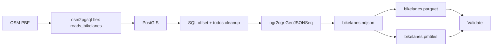
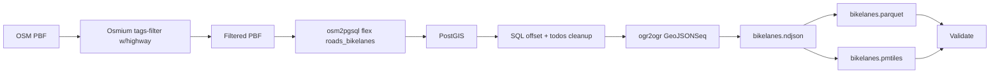
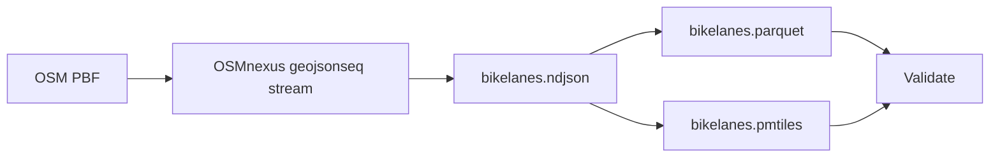
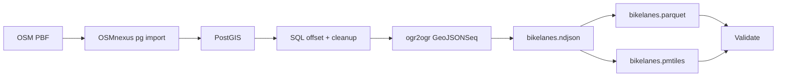

# Benchmark Summary

Generated from run artifact: `/Users/tordans/Development/OSM/osm-processing-pipeline-comparison/results/runs/run-2026-07-10T21-30-38-392Z-berlin.json`

- **Run ID:** `2026-07-10T21-30-38-392Z`
- **Dataset:** `berlin`
- **Input:** `/Users/tordans/Development/OSM/osm-processing-pipeline-comparison/data/raw/berlin-latest.osm.pbf`
- **Window:** `2026-07-10T21:30:38.392Z` → `2026-07-10T21:32:31.366Z`
- **Pipelines OK:** 4 / 4

## How to read this report

- Timings and requirement status are read from each pipeline’s `comparison.json` only.
- **Build** is `docker build` time on the host (one-time per image change).
- **Container** is wall time for `docker run`.
- **In-container total** is script wall time inside the container.
- **Durations** use `M:SS` (minutes:seconds), rounded to the nearest second.
- **Pipeline** names in tables link to [Pipeline flows](#pipeline-flows) below.

## Dataset used for this run

- **Name:** `berlin`
- **Input path:** `/workspace/data/raw/berlin-latest.osm.pbf`
- **Source URL:** https://download.geofabrik.de/europe/germany/berlin-latest.osm.pbf

## Comparable timings and requirements

All values come from each pipeline’s `comparison.json` (canonical schema). `—` means the step is not applicable for that pipeline.

| Pipeline | Dataset | Filter | Clean/transform | GeoParquet | PMTiles | SQL postprocess | Validate | In-container total | Build | Container | Total |
| --- | --- | --- | --- | --- | --- | --- | --- | --- | --- | --- | --- |
| [roads-bikelanes-osm2pgsql-direct](#roads-bikelanes-osm2pgsql-direct) | berlin | — | 0:34 | 0:01 | 0:02 | 0:04 | 0:00 | 0:43 | 0:01 | 0:44 | 0:45 |
| [roads-bikelanes-osm2pgsql-prefilter-osmium](#roads-bikelanes-osm2pgsql-prefilter-osmium) | berlin | 0:02 | 0:33 | 0:01 | 0:02 | 0:00 | 0:00 | 0:41 | 0:01 | 0:42 | 0:42 |
| [roads-bikelanes-osmnexus-geojsonseq](#roads-bikelanes-osmnexus-geojsonseq) | berlin | — | 0:07 | 0:01 | 0:03 | — | 0:00 | 0:11 | 0:01 | 0:12 | 0:13 |
| [roads-bikelanes-osmnexus-postgis](#roads-bikelanes-osmnexus-postgis) | berlin | — | 0:04 | 0:01 | 0:02 | 0:01 | 0:00 | 0:11 | 0:02 | 0:12 | 0:13 |

### Core requirements

| Pipeline | 1. GeoParquet | 2. PMTiles | 3. Filter/clean/confirmed | 4. SQL postprocess/confirmed | Val OK | Features | Parquet | PMTiles |
| --- | --- | --- | --- | --- | --- | --- | --- | --- |
| [roads-bikelanes-osm2pgsql-direct](#roads-bikelanes-osm2pgsql-direct) | yes | yes | yes | yes | yes | 38898 | 3.01 MiB | 9.51 MiB |
| [roads-bikelanes-osm2pgsql-prefilter-osmium](#roads-bikelanes-osm2pgsql-prefilter-osmium) | yes | yes | yes | yes | yes | 38898 | 3.01 MiB | 9.51 MiB |
| [roads-bikelanes-osmnexus-geojsonseq](#roads-bikelanes-osmnexus-geojsonseq) | yes | yes | yes | no (No SQL/PostGIS stage; geometries not offset) | yes | 39027 | 2.87 MiB | 6.66 MiB |
| [roads-bikelanes-osmnexus-postgis](#roads-bikelanes-osmnexus-postgis) | yes | yes | yes | yes | yes | 39027 | 3.15 MiB | 9.44 MiB |

## Pipeline flows

How each pipeline processes the same input PBF. Pipeline names in the tables above link here.

### Quick links

[roads-bikelanes-osm2pgsql-direct](#roads-bikelanes-osm2pgsql-direct) · [roads-bikelanes-osm2pgsql-prefilter-osmium](#roads-bikelanes-osm2pgsql-prefilter-osmium) · [roads-bikelanes-osmnexus-geojsonseq](#roads-bikelanes-osmnexus-geojsonseq) · [roads-bikelanes-osmnexus-postgis](#roads-bikelanes-osmnexus-postgis)

### roads-bikelanes-osm2pgsql-direct

Full PBF import via tilda-geo osm2pgsql flex (no prefilter), PostGIS SQL, then NDJSON → GeoParquet + PMTiles.

### roads-bikelanes-osm2pgsql-prefilter-osmium

Osmium prefilter (highway ways) before tilda-geo osm2pgsql flex import, PostGIS SQL offset/cleanup, then shared NDJSON exports.

### roads-bikelanes-osmnexus-geojsonseq

OSMnexus streams filtered bikelanes to NDJSON; GeoPandas Parquet and tippecanoe PMTiles. No database.

### roads-bikelanes-osmnexus-postgis

OSMnexus filters while importing into Postgres; SQL offset/cleanup; same export path as osm2pgsql variants.

## vs osm2pgsql + Osmium prefilter (B2 reference)

`osm2pgsql-postgis-prefilter` was not present in this run; skipping reference comparison.

## B2 vs osmfilter prefilter (Osmium vs osmctools)

`osm2pgsql-postgis-prefilter` and/or `osm2pgsql-postgis-prefilter-osmfilter` were not present in this run; skipping Osmium vs osmfilter comparison.

## Cosmo dual-pass vs single-pass + GDAL

Both `cosmo-playgrounds-dual-pass` and `cosmo-playgrounds-single-pass` must be present in this run; skipping variant comparison.

## B1 vs B2 (prefilter vs direct osm2pgsql)

No B1/B2 pair found in this run.

## Failures

None.

## Installation cost notes

Image build time dominates the first run; for recurring benchmarks, compare **In-container (script)** and **Container** after images are built. Setup/install cost is documented in `results/notes/installation-costs.md` (not part of processing totals).

## Raw artifacts

- Per-pipeline: `data/output/<pipeline-id>/<dataset>/comparison.json`, `validation.json`, `step_timings.json`
- Full run: `results/runs/*.json`
