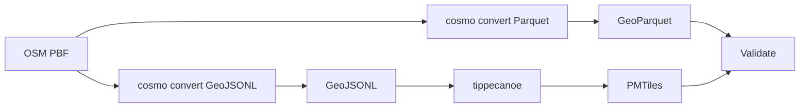
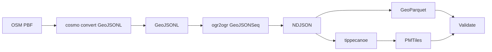
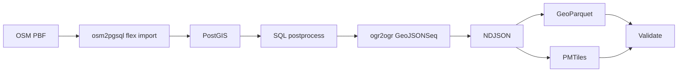
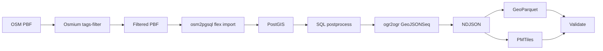
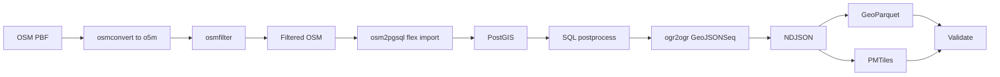
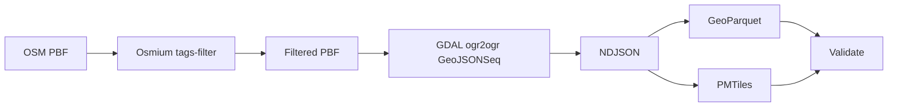

# Benchmark Summary

Generated from run artifact: `/Users/tordans/Development/OSM/osm-processing-pipeline-comparison/results/runs/run-2026-05-20T18-10-55-079Z-germany.json`

- **Run ID:** `2026-05-20T18-10-55-079Z`
- **Dataset:** `germany`
- **Input:** `/Users/tordans/Development/OSM/osm-processing-pipeline-comparison/data/raw/germany-latest.osm.pbf`
- **Window:** `2026-05-20T18:10:55.079Z` → `2026-05-20T18:44:58.882Z`
- **Pipelines OK:** 7 / 7

## How to read this report

- Timings and requirement status are read from each pipeline’s `comparison.json` only.
- **Build** is `docker build` time on the host (one-time per image change).
- **Container** is wall time for `docker run`.
- **In-container total** is script wall time inside the container.
- **Durations** use `M:SS` (minutes:seconds), rounded to the nearest second.
- **Pipeline** names in tables link to [Pipeline flows](#pipeline-flows) below.

## Dataset used for this run

- **Name:** `germany`
- **Input path:** `/workspace/data/raw/germany-latest.osm.pbf`
- **Source URL:** https://download.geofabrik.de/europe/germany-latest.osm.pbf

## Comparable timings and requirements

All values come from each pipeline’s `comparison.json` (canonical schema). `—` means the step is not applicable for that pipeline.

| Pipeline | Dataset | Filter | Clean/transform | GeoParquet | PMTiles | SQL postprocess | Validate | In-container total | Build | Container | Total |
| --- | --- | --- | --- | --- | --- | --- | --- | --- | --- | --- | --- |
| [cosmo-playgrounds-dual-pass](#cosmo-playgrounds-dual-pass) | germany | — | 1:40 | 1:27 | 0:07 | — | 0:00 | 3:14 | 0:02 | 3:15 | 3:17 |
| [cosmo-playgrounds-single-pass](#cosmo-playgrounds-single-pass) | germany | — | 1:51 | 0:02 | 0:05 | — | 0:00 | 1:58 | 0:03 | 1:59 | 2:01 |
| [osm2pgsql-postgis-direct](#osm2pgsql-postgis-direct) | germany | — | 22:44 | 0:02 | 0:05 | 0:01 | 0:00 | 22:51 | 0:01 | 22:56 | 22:57 |
| [osm2pgsql-postgis-prefilter](#osm2pgsql-postgis-prefilter) | germany | 0:34 | 0:02 | 0:01 | 0:04 | 0:00 | 0:00 | 0:44 | 0:05 | 0:47 | 0:52 |
| [osm2pgsql-postgis-prefilter-osmfilter](#osm2pgsql-postgis-prefilter-osmfilter) | germany | 2:21 | 0:02 | 0:01 | 0:05 | 0:00 | 0:00 | 2:32 | 0:01 | 2:33 | 2:34 |
| [osmium-gdal-tippecanoe](#osmium-gdal-tippecanoe) | germany | 0:33 | 0:01 | 0:02 | 0:04 | — | 0:00 | 0:40 | 0:03 | 0:40 | 0:43 |
| [planetiler-playgrounds](#planetiler-playgrounds) | germany | — | — | — | 1:37 | — | 0:00 | 1:37 | 0:01 | 1:38 | 1:39 |

### Core requirements

| Pipeline | 1. GeoParquet | 2. PMTiles | 3. Filter/clean/confirmed | 4. SQL postprocess/confirmed | Val OK | Features | Parquet | PMTiles |
| --- | --- | --- | --- | --- | --- | --- | --- | --- |
| [cosmo-playgrounds-dual-pass](#cosmo-playgrounds-dual-pass) | yes | yes | yes | no (Pipeline has no SQL/PostGIS stage) | yes | 86298 | 4.07 MiB | 3.27 MiB |
| [cosmo-playgrounds-single-pass](#cosmo-playgrounds-single-pass) | yes | yes | yes | no (Pipeline has no SQL/PostGIS stage) | yes | 86298 | 3.01 MiB | 3.27 MiB |
| [osm2pgsql-postgis-direct](#osm2pgsql-postgis-direct) | yes | yes | yes | yes | yes | 86303 | 3.67 MiB | 7.98 MiB |
| [osm2pgsql-postgis-prefilter](#osm2pgsql-postgis-prefilter) | yes | yes | yes | yes | yes | 86303 | 3.67 MiB | 7.98 MiB |
| [osm2pgsql-postgis-prefilter-osmfilter](#osm2pgsql-postgis-prefilter-osmfilter) | yes | yes | yes | yes | yes | 86303 | 3.67 MiB | 7.98 MiB |
| [osmium-gdal-tippecanoe](#osmium-gdal-tippecanoe) | yes | yes | yes | no (Pipeline has no SQL/PostGIS stage) | yes | 86738 | 4.15 MiB | 10.21 MiB |
| [planetiler-playgrounds](#planetiler-playgrounds) | no (Planetiler does not emit GeoParquet) | yes | yes | no (Pipeline has no SQL/PostGIS stage) | yes | — | — | 12.98 MiB |

## Pipeline flows

How each pipeline processes the same input PBF. Pipeline names in the tables above link here.

### Quick links

[cosmo-playgrounds-dual-pass](#cosmo-playgrounds-dual-pass) · [cosmo-playgrounds-single-pass](#cosmo-playgrounds-single-pass) · [osm2pgsql-postgis-direct](#osm2pgsql-postgis-direct) · [osm2pgsql-postgis-prefilter](#osm2pgsql-postgis-prefilter) · [osm2pgsql-postgis-prefilter-osmfilter](#osm2pgsql-postgis-prefilter-osmfilter) · [osmium-gdal-tippecanoe](#osmium-gdal-tippecanoe) · [planetiler-playgrounds](#planetiler-playgrounds)

### cosmo-playgrounds-dual-pass

Two cosmo convert passes on the PBF: native GeoParquet, then GeoJSONL for tippecanoe PMTiles.

### cosmo-playgrounds-single-pass

One cosmo convert to GeoJSONL, GDAL normalization, then GeoPandas Parquet and tippecanoe PMTiles.

### osm2pgsql-postgis-direct

Full PBF import via osm2pgsql flex into PostGIS, SQL enrichment, then shared NDJSON exports. No upstream prefilter.

### osm2pgsql-postgis-prefilter

Osmium prefilter before osm2pgsql; same PostGIS SQL and export path as B1 (B2 reference pipeline).

### osm2pgsql-postgis-prefilter-osmfilter

Prefilter via osmconvert + osmfilter (o5m), then same osm2pgsql → PostGIS → exports stack as B2.

### osmium-gdal-tippecanoe

Osmium prefilter on PBF, GDAL to GeoJSONSeq, then GeoParquet (GeoPandas) and PMTiles (tippecanoe). No database.

### planetiler-playgrounds

Single Planetiler JVM pass from PBF to PMTiles via YAML rules. No GeoParquet or SQL stage.

## vs osm2pgsql + Osmium prefilter (B2 reference)

Baseline: **osm2pgsql-postgis-prefilter** (Osmium `tags-filter` + osm2pgsql → PostGIS → exports). Other pipelines show wall-time deltas and relative duration vs that baseline.

| Pipeline | Total (build+run) vs B2 | Container vs B2 | In-container (script) vs B2 |
| --- | --- | --- | --- |
| [osm2pgsql-postgis-prefilter](#osm2pgsql-postgis-prefilter) | baseline | baseline | baseline |
| [cosmo-playgrounds-dual-pass](#cosmo-playgrounds-dual-pass) | 2:25 slower; 280.3% more time than reference | 2:28 slower; 316.3% more time than reference | 2:30 slower; 342.4% more time than reference |
| [cosmo-playgrounds-single-pass](#cosmo-playgrounds-single-pass) | 1:10 slower; 134.9% more time than reference | 1:12 slower; 153.3% more time than reference | 1:14 slower; 169.2% more time than reference |
| [osm2pgsql-postgis-direct](#osm2pgsql-postgis-direct) | 22:06 slower; 2563.6% more time than reference | 22:09 slower; 2839.2% more time than reference | 22:07 slower; 3025.3% more time than reference |
| [osm2pgsql-postgis-prefilter-osmfilter](#osm2pgsql-postgis-prefilter-osmfilter) | 1:43 slower; 198.3% more time than reference | 1:46 slower; 227.2% more time than reference | 1:49 slower; 247.4% more time than reference |
| [osmium-gdal-tippecanoe](#osmium-gdal-tippecanoe) | 0:08 faster; 16.2% less time than reference | 0:07 faster; 13.9% less time than reference | 0:04 faster; 9.2% less time than reference |
| [planetiler-playgrounds](#planetiler-playgrounds) | 0:47 slower; 91.5% more time than reference | 0:51 slower; 108.3% more time than reference | 0:53 slower; 121.1% more time than reference |

### Comparable in-container steps (canonical `comparison.json` keys)

Only canonical steps with numeric timings in B2 and another pipeline; empty cells mean that pipeline has no timing for that step.

| Step | [cosmo-playgrounds-dual-pass](#cosmo-playgrounds-dual-pass) | [cosmo-playgrounds-single-pass](#cosmo-playgrounds-single-pass) | [osm2pgsql-postgis-direct](#osm2pgsql-postgis-direct) | [osm2pgsql-postgis-prefilter-osmfilter](#osm2pgsql-postgis-prefilter-osmfilter) | [osmium-gdal-tippecanoe](#osmium-gdal-tippecanoe) | [planetiler-playgrounds](#planetiler-playgrounds) |
| --- | --- | --- | --- | --- | --- | --- |
| filter | — | — | — | 1:47 slower; 319.0% more time than reference | 0:01 faster; 3.0% less time than reference | — |
| cleanTransform | 1:38 slower; 4791.7% more time than reference | 1:49 slower; 5294.9% more time than reference | 22:42 slower; 66383.3% more time than reference | 0:00 faster; 12.7% less time than reference | 0:01 faster; 56.6% less time than reference | — |
| exportGeoParquet | 1:25 slower; 6056.1% more time than reference | 0:01 slower; 73.4% more time than reference | 0:00 slower; 13.6% more time than reference | 0:00 faster; 1.6% less time than reference | 0:00 slower; 22.3% more time than reference | — |
| exportPmtiles | 0:03 slower; 76.0% more time than reference | 0:01 slower; 25.4% more time than reference | 0:01 slower; 31.9% more time than reference | 0:01 slower; 31.9% more time than reference | 0:00 slower; 12.2% more time than reference | 1:33 slower; 2390.1% more time than reference |
| sqlPostprocess | — | — | 0:00 slower; 32.9% more time than reference | 0:00 faster; 16.1% less time than reference | — | — |
| validate | 0:00 slower; 35.9% more time than reference | 0:00 faster; 21.8% less time than reference | 0:00 slower; 12.2% more time than reference | 0:00 slower; 76.3% more time than reference | 0:00 (baseline) | 0:00 faster; 67.9% less time than reference |

## B2 vs osmfilter prefilter (Osmium vs osmctools)

Same downstream steps as B2; only the prefilter differs: **B2** uses Osmium `tags-filter` on PBF; **osmfilter pipeline** uses `osmconvert` (full PBF→`.o5m`) then `osmfilter` (see [osmium-tool#253](https://github.com/osmcode/osmium-tool/issues/253)).

- **B2 prefilter (Osmium):** 0:34
- **osmfilter pipeline prefilter (total):** 2:21
- **Prefilter ratio (osmfilter total ÷ B2 Osmium):** 4.19×

## Cosmo dual-pass vs single-pass + GDAL

**Dual-pass:** two `cosmo convert` runs (native GeoParquet + GeoJSONL) then tippecanoe. **Single-pass:** one `cosmo convert` → `ogr2ogr` GeoJSONSeq → GeoPandas Parquet + tippecanoe.

| Metric | [dual-pass](#cosmo-playgrounds-dual-pass) | [single-pass](#cosmo-playgrounds-single-pass) | dual vs single |
| --- | --- | --- | --- |
| Total (build+run) | 3:17 | 2:01 | 1:15 faster; 38.2% less time than reference |
| Container wall | 3:15 | 1:59 | 1:16 faster; 39.1% less time than reference |
| In-container (script) | 3:14 | 1:58 | 1:16 faster; 39.1% less time than reference |

- **Cosmo OSM read time (dual):** 3:07 (`exportGeoParquet` + `cleanTransform`)
- **Cosmo OSM read time (single):** 1:51 (`cleanTransform`)
- **Cosmo read ratio (dual total ÷ single):** 1.69×

### Step breakdown (in-container)

| Step | [dual-pass](#cosmo-playgrounds-dual-pass) | [single-pass](#cosmo-playgrounds-single-pass) | dual vs single |
| --- | --- | --- | --- |
| `cleanTransform` | 1:40 | 1:51 | 0:10 slower; 10.3% more time than reference |
| `exportGeoParquet` | 1:27 | 0:02 | 1:24 faster; 97.2% less time than reference |
| `exportPmtiles` | 0:07 | 0:05 | 0:02 faster; 28.8% less time than reference |
| `validate` | 0:00 | 0:00 | 0:00 faster; 42.5% less time than reference |

## Cross-pipeline sanity (feature counts)

- **[osmium-gdal-tippecanoe](#osmium-gdal-tippecanoe):** 86738 features
- **[osm2pgsql B1](#osm2pgsql-postgis-direct):** 86303 features
- **Delta:** 435 (0.5% vs B1). Different OSM-to-geometry assembly (GDAL OSM driver vs osm2pgsql flex) commonly yields small count differences; B1 and B2 should match when the extract is equivalent.

## Validation warnings

- **[cosmo-playgrounds-dual-pass](#cosmo-playgrounds-dual-pass):** Cosmo relation geometry omitted (relation: false); counts may be lower than nwr/osmium pipelines.
- **[cosmo-playgrounds-dual-pass](#cosmo-playgrounds-dual-pass):** GeoParquet from native cosmo; PMTiles from a second full OSM read via cosmo GeoJSONL.
- **[cosmo-playgrounds-single-pass](#cosmo-playgrounds-single-pass):** Cosmo relation geometry omitted (relation: false); counts may be lower than nwr/osmium pipelines.
- **[cosmo-playgrounds-single-pass](#cosmo-playgrounds-single-pass):** GeoParquet via GeoPandas from GDAL-normalized GeoJSONSeq (not cosmo-native Parquet).

## B1 vs B2 (prefilter vs direct osm2pgsql)

- **End-to-end (build + container wall):** B2 is 22:06 faster than B1.
- **B2 osmium prefilter:** 0:34
- **Clean/transform (B2 − B1):** -22:42
- **In-container total (B2 − B1):** -22:07 (from each pipeline’s `comparison.json`, excludes image build)

## Failures

None.

## Installation cost notes

Image build time dominates the first run; for recurring benchmarks, compare **In-container (script)** and **Container** after images are built. Setup/install cost is documented in `results/notes/installation-costs.md` (not part of processing totals).

## Raw artifacts

- Per-pipeline: `data/output/<pipeline-id>/<dataset>/comparison.json`, `validation.json`, `step_timings.json`
- Full run: `results/runs/*.json`
