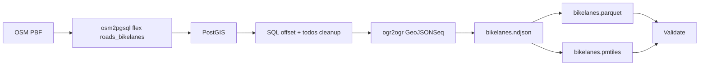
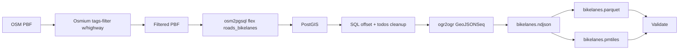
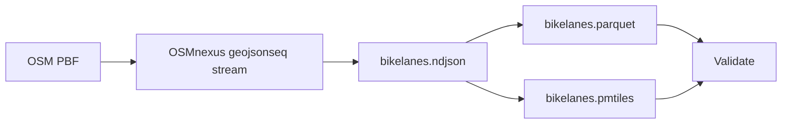
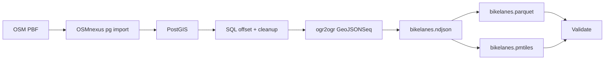

# Benchmark Summary

Generated from run artifact: `/Users/tordans/Development/OSM/osm-processing-pipeline-comparison/results/runs/run-2026-07-11T07-28-55-060Z-germany.json`

- **Run ID:** `2026-07-11T07-28-55-060Z`
- **Dataset:** `germany`
- **Input:** `/Users/tordans/Development/OSM/osm-processing-pipeline-comparison/data/raw/germany-latest.osm.pbf`
- **Window:** `2026-07-11T07:28:55.060Z` → `2026-07-11T08:00:50.193Z`
- **Pipelines OK:** 4 / 4
- **Reused from cache:** 2 pipeline(s) (see footnote under timings)

## How to read this report

- Timings and requirement status are read from each pipeline’s `comparison.json` only.
- **Build** is `docker build` time on the host (one-time per image change).
- **Container** is wall time for `docker run`.
- **In-container total** is script wall time inside the container.
- **Durations** use `M:SS` (minutes:seconds), rounded to the nearest second.
- **Pipeline** names in tables link to [Pipeline flows](#pipeline-flows) below.

## Dataset used for this run

- **Name:** `germany`
- **Input path:** `/workspace/data/raw/germany-latest.osm.pbf`
- **Source URL:** https://download.geofabrik.de/europe/germany-latest.osm.pbf

## Comparable timings and requirements

All values come from each pipeline’s `comparison.json` (canonical schema). `—` means the step is not applicable for that pipeline.

| Pipeline | Dataset | Filter | Clean/transform | GeoParquet | PMTiles | SQL postprocess | Validate | In-container total | Build | Container | Total |
| --- | --- | --- | --- | --- | --- | --- | --- | --- | --- | --- | --- |
| [roads-bikelanes-osm2pgsql-direct](#roads-bikelanes-osm2pgsql-direct) | germany | — | 33:00 | 0:18 | 1:38 | 0:25 | 0:10 | 35:34 | 0:03 | 35:36 | 35:39 |
| [roads-bikelanes-osm2pgsql-prefilter-osmium](#roads-bikelanes-osm2pgsql-prefilter-osmium) | germany | 0:41 | 25:11 | 0:17 | 1:19 | 0:31 | 0:13 | 28:15 | 0:01 | 28:17 | 28:18 |
| [roads-bikelanes-osmnexus-geojsonseq](#roads-bikelanes-osmnexus-geojsonseq) | germany | — | 10:48 | 0:47 | 2:15 | — | 0:20 | 14:10 | 0:03 | 14:13 | 14:16 |
| [roads-bikelanes-osmnexus-postgis](#roads-bikelanes-osmnexus-postgis) | germany | — | 11:53 | 0:18 | 1:48 | 3:23 | 0:03 | 17:26 | 0:02 | 17:37 | 17:39 |

### Cached pipeline results

These pipelines were unchanged since a prior successful run; timings below are from the original run (no docker build/run this session).

- **[roads-bikelanes-osm2pgsql-direct](#roads-bikelanes-osm2pgsql-direct):** ok (cached 2026-07-10) — original run `2026-07-10T21-35-25-081Z`, recorded 2026-07-10T22:39:21.950Z
- **[roads-bikelanes-osm2pgsql-prefilter-osmium](#roads-bikelanes-osm2pgsql-prefilter-osmium):** ok (cached 2026-07-10) — original run `2026-07-10T21-35-25-081Z`, recorded 2026-07-10T22:03:42.936Z

### Core requirements

| Pipeline | 1. GeoParquet | 2. PMTiles | 3. Filter/clean/confirmed | 4. SQL postprocess/confirmed | Val OK | Features | Parquet | PMTiles |
| --- | --- | --- | --- | --- | --- | --- | --- | --- |
| [roads-bikelanes-osm2pgsql-direct](#roads-bikelanes-osm2pgsql-direct) | yes | yes | yes | yes | yes | 993139 | 108.41 MiB | 115.08 MiB |
| [roads-bikelanes-osm2pgsql-prefilter-osmium](#roads-bikelanes-osm2pgsql-prefilter-osmium) | yes | yes | yes | yes | yes | 993139 | 108.41 MiB | 115.08 MiB |
| [roads-bikelanes-osmnexus-geojsonseq](#roads-bikelanes-osmnexus-geojsonseq) | yes | yes | yes | no (No SQL/PostGIS stage; geometries not offset) | yes | 1000109 | 87.64 MiB | 85.79 MiB |
| [roads-bikelanes-osmnexus-postgis](#roads-bikelanes-osmnexus-postgis) | yes | yes | yes | yes | yes | 1000109 | 107.84 MiB | 115.56 MiB |

## Pipeline flows

How each pipeline processes the same input PBF. Pipeline names in the tables above link here.

### Quick links

[roads-bikelanes-osm2pgsql-direct](#roads-bikelanes-osm2pgsql-direct) · [roads-bikelanes-osm2pgsql-prefilter-osmium](#roads-bikelanes-osm2pgsql-prefilter-osmium) · [roads-bikelanes-osmnexus-geojsonseq](#roads-bikelanes-osmnexus-geojsonseq) · [roads-bikelanes-osmnexus-postgis](#roads-bikelanes-osmnexus-postgis)

### roads-bikelanes-osm2pgsql-direct

Full PBF import via tilda-geo osm2pgsql flex (no prefilter), PostGIS SQL, then NDJSON → GeoParquet + PMTiles.

### roads-bikelanes-osm2pgsql-prefilter-osmium

Osmium prefilter (highway ways) before tilda-geo osm2pgsql flex import, PostGIS SQL offset/cleanup, then shared NDJSON exports.

### roads-bikelanes-osmnexus-geojsonseq

OSMnexus streams filtered bikelanes to NDJSON; GeoPandas Parquet and tippecanoe PMTiles. No database.

### roads-bikelanes-osmnexus-postgis

OSMnexus filters while importing into Postgres; SQL offset/cleanup; same export path as osm2pgsql variants.

## vs osm2pgsql + Osmium prefilter (B2 reference)

`osm2pgsql-postgis-prefilter` was not present in this run; skipping reference comparison.

## B2 vs osmfilter prefilter (Osmium vs osmctools)

`osm2pgsql-postgis-prefilter` and/or `osm2pgsql-postgis-prefilter-osmfilter` were not present in this run; skipping Osmium vs osmfilter comparison.

## Cosmo dual-pass vs single-pass + GDAL

Both `cosmo-playgrounds-dual-pass` and `cosmo-playgrounds-single-pass` must be present in this run; skipping variant comparison.

## B1 vs B2 (prefilter vs direct osm2pgsql)

No B1/B2 pair found in this run.

## Failures

None.

## Installation cost notes

Image build time dominates the first run; for recurring benchmarks, compare **In-container (script)** and **Container** after images are built. Setup/install cost is documented in `results/notes/installation-costs.md` (not part of processing totals).

## Raw artifacts

- Per-pipeline: `data/output/<pipeline-id>/<dataset>/comparison.json`, `validation.json`, `step_timings.json`
- Full run: `results/runs/*.json`
